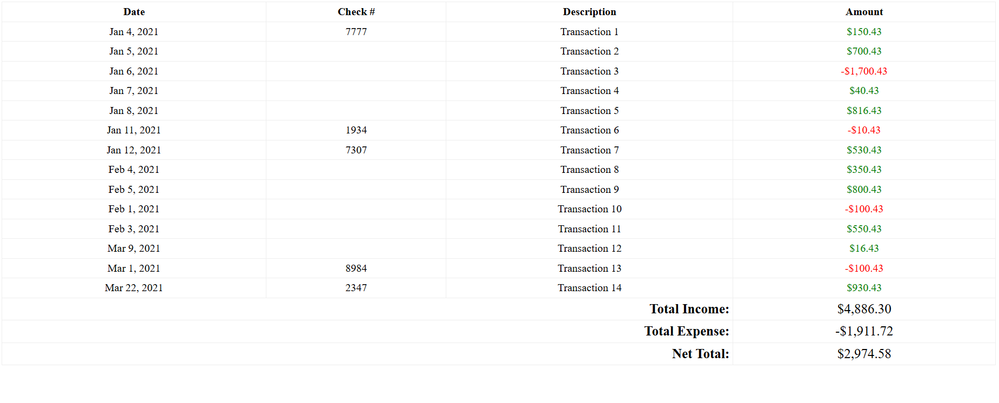

# Transaction Processor

## Project Setup

This project reads and processes CSV transaction files, calculates total income, total expense, and net total, and displays the transactions in an HTML table.

### Instructions

1. **Set Document Root**:
   - Set your web server's document root to `YOUR_PROJECT/public`. This way, the site will be loaded from `public/index.php`.

2. **Main File**:
   - Use `index.php` as your main file. Include/require all other necessary files within this file.

3. **Defined Constants**:
   - You can use the following constants to help with including files:
     - `APP_PATH`: Path to the application directory.
     - `FILES_PATH`: Path to the transaction files directory.
     - `VIEWS_PATH`: Path to the views directory.

4. **Main Logic**:
   - Place your main code in the `app` directory. You can use the provided `App.php` file for your main logic, but feel free to organize it as you see fit.

5. **Processing Transactions**:
   - Define functions to read and process all `.csv` files within the `transaction_files` directory. The provided sample file contains formatted data, and you can assume all files will be in the same format.
   - Store the transaction data in memory using an array.

6. **CSV File Format**:
   - The first column is the transaction date.
   - The second column is the check number (optional).
   - The third column is the transaction description.
   - The fourth column is the amount (negative for expenses, positive for income).

7. **Calculations**:
   - Calculate the total income, total expense, and net total (total income - total expense).

8. **Display Data**:
   - Print the transaction data in an HTML table. Use the `views/transactions.php` file as the HTML skeleton.
   - Format the transaction date as "Jan 4, 2021".
   - Display income amounts in green and expense amounts in red.

## Usage

1. Place your transaction `.csv` files in the `transaction_files` directory.
2. Access your project via the web server. The main logic will read and process the transaction files and display the data in an HTML table.

## Example

Here is an example of what the table should look like

